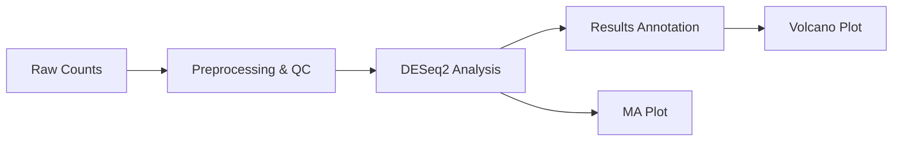
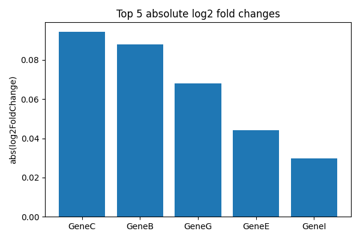

# Bioinformatics Analysis Pipeline

[](https://opensource.org/licenses/MIT)
[](https://snakemake.github.io)
[](https://www.r-project.org/)

A modular and reproducible framework for developing and optimizing bioinformatics tools and pipelines. Focused on RNA-Seq and single-cell RNA-Seq analysis, cohort studies, and interactive data visualization. Designed for collaboration with laboratory scientists and supports drug discovery initiatives.

## ✨ Features

*   **Bulk RNA-Seq Analysis:** Automated pipeline from counts to annotated results using DESeq2.
*   **Single-cell RNA-Seq Analysis:** End-to-end analysis with Seurat (R), including demo data.
*   **Interactive Visualization:** Dash (Python) and Shiny (R) apps for data exploration.
*   **Reproducible Workflows:** Managed with Snakemake and Nextflow.
*   **Documentation & Training:** Comprehensive protocols, SOPs, and materials for team collaboration.
*   **QC & Reporting:** Integrated quality control and reporting at every step.

## 📁 Project Structure

```
bioinformatics-pipeline/
├── rna_seq/                 # Bulk RNA-Seq analysis (DESeq2)
├── scrna_seq/               # Single-cell RNA-Seq analysis (Seurat)
│   ├── data/                # Input data (includes demo dataset)
│   ├── scrna_seq_analysis.R # Main analysis script
│   └── results/             # Output directory for plots & results
├── visualization/           # Interactive apps (Dash, Shiny)
├── workflows/               # Pipeline definitions (Snakemake, Nextflow)
└── docs/                    # Protocols, SOPs, and documentation
```

## 🚀 Quick Start

### Bulk RNA-Seq Pipeline (Snakemake)

1.  **Set up the environment:**
    ```bash
    source .venv/bin/activate  # Activate your virtual environment
    ```

2.  **Run the entire pipeline:**
    ```bash
    snakemake --snakefile workflows/Snakefile --cores 1 --printshellcmds
    ```
    *Outputs will be generated in the `rna_seq/` directory.*

### Single-cell RNA-Seq Demo (Seurat)

1.  **Navigate to the scRNA-seq directory and run the analysis:**
    ```bash
    cd scrna_seq
    Rscript scrna_seq_analysis.R
    ```
    *Results (plots, markers, Seurat object) will be saved in `scrna_seq/results/`.*

---

## 🔬 Pipeline Details

### 1. Bulk RNA-Seq Analysis

A Snakemake-managed pipeline for differential expression analysis.

**Workflow Overview:**


**Steps:**
1.  **Preprocessing & QC** (`preprocess_qc.py`): Loads `sample_counts.csv`, performs QC, and outputs a cleaned matrix and library size plot.
2.  **Differential Expression** (`deseq2_analysis.R`): Runs DESeq2 to identify DEGs. Outputs results and an MA plot.
3.  **Annotation** (`annotate_results.py`): Merges results with `gene_annotation.csv` for biological context.
4.  **Visualization** (`volcano_plot.py`): Generates a volcano plot from the annotated results.

### 2. Single-Cell RNA-Seq Analysis

A Seurat-based pipeline for analyzing scRNA-seq data.

**Steps include:**
*   Data loading (10x Genomics format supported)
*   Quality control and filtering
*   Normalization and feature selection
*   Dimensionality reduction (PCA, UMAP)
*   Clustering and marker gene identification
*   Visualization (UMAP plots, feature plots)

**Demo Data:** A synthetic 10x-style dataset (500 genes x 50 cells) is provided in `scrna_seq/data/demo_10x/` to test the pipeline.

---

## 🧠 Integration Strategy: Bulk & Single-Cell

A key strength of this framework is the ability to integrate findings across data modalities.

1.  **Independent Analysis:** Run bulk and single-cell pipelines separately to get DEGs and cluster markers.
2.  **Comparative Analysis:** Overlap DEGs from bulk with marker genes from single-cell to identify which cell types drive population-level changes.
3.  **Deconvolution:** Use single-cell data as a reference (e.g., with CIBERSORTx) to estimate cell type proportions in bulk samples.
4.  **Cross-Validation:** Validate bulk findings by confirming DEG expression in specific cell clusters from the single-cell data.
*This integrated approach provides a more complete biological narrative, linking population-level changes to their cellular origins.*

This project produces integrated clinical and bioinformatics reports designed to surface actionable insights for downstream validation and decision-making.

Mapping CSV format (optional)
-----------------------------

To reliably join scRNA marker genes and bulk-DE gene identifiers you can provide a small mapping CSV that normalizes identifiers to a canonical symbol. The integrator script supports an optional `--mapping` CSV with the following columns:

- `source_id` — identifier used in the markers file (e.g., raw gene name from Seurat `markers.csv`).
- `canonical_symbol` — canonical gene symbol used in the report (e.g., HGNC symbol or the ID used in your DE table).

Example `workflows_local/gene_mapping_example.csv`:

source_id,canonical_symbol
Gene145,GeneA
Gene383,GeneB

Usage example (integrator):

```bash
python workflows_local/integrate_genomics_clinical.py rna_seq/annotated_results.csv clinical/analysis_results.csv docs/report_example.csv \
    --markers scrna_seq/results/markers.csv --mapping workflows_local/gene_mapping_example.csv
```

If the mapping file is missing or invalid the script will warn and fall back to matching by symbol/gene_id with conservative fuzzy matching.

Example actionable report fields
--------------------------------

An example final report generated by the integration step may include columns such as:

- `gene_id` - primary gene identifier (e.g., Ensembl or Entrez)
- `symbol` - gene symbol
- `log2FoldChange` - effect size from DE analysis
- `padj` - adjusted p-value for significance
- `clinical_association` - clinical feature or phenotype associated (e.g., responder vs non-responder)
- `cohort_frequency` - fraction of cohort samples with the event/expression
- `note` - short actionable recommendation (e.g., "validate by qPCR", "prioritize for biomarker panel")

This structure is intentionally lightweight and can be extended per-study to include sample-level evidence, cell-type specificity, or downstream assay recommendations.

Download the small example integrated report (CSV): [docs/report_example.csv](docs/report_example.csv)



## 🧪 Methods Overview

| Analysis Type | Key Tools | Primary Methods |
| :--- | :--- | :--- |
| **Bulk RNA-Seq** | DESeq2, Snakemake | Negative binomial GLM, Wald test, FDR correction |
| **Single-Cell RNA-Seq** | Seurat | Log-normalization, HVG selection, PCA, graph-based clustering, Wilcoxon rank-sum test |
| **Workflow Management** | Snakemake, Nextflow | Directed acyclic graph (DAG) execution, dependency resolution, conditional branching, checkpointing, portability across environments |

**Key Workflow Management Features:**
- **Reproducibility:** Automated, self-documenting pipelines ensure consistent results.
- **Scalability:** Seamless scaling from local computers to clusters and cloud environments.
- **Modularity:** Complex workflows are broken into manageable, reusable rules/processes.
- **Portability:** Containerization support (Docker/Singularity) ensures consistent software environments across different systems.

---

## 🔮 Future Roadmap

This repository is designed for extensibility. Planned enhancements include:
*   **Multi-omics Integration:** Support for proteomics, metabolomics, and ATAC-seq data.
*   **Advanced Visualization:** Enhanced interactive dashboards for integrated data exploration.
*   **Cloud/HPC Support:** Scale analyses on cloud platforms and high-performance clusters.
*   **Automated Reporting:** Generate comprehensive HTML/PDF reports for sharing insights.
*   **Parameter Sweeps:** Tools for automated large-scale batch analysis and optimization.


## 🧪 Development & CI

This repository includes automated tests and CI workflows to keep the pipeline stable:

- `CHANGELOG.md` - a running changelog for unreleased and released changes.
- GitHub Actions workflows:
    - `.github/workflows/ci.yml` - lightweight CI that installs Python deps, runs `pytest`, and performs a Snakemake dry-run (`-n`).
    - `.github/workflows/ci-full.yml` - (optional) runs Snakemake inside an R-enabled Docker image and installs DESeq2 to validate R dependencies (dry-run).

Run tests locally before pushing changes:

```bash
source .venv/bin/activate
pytest -q
```

If you want CI to run the full pipeline and produce artifacts, update the CI workflow to store outputs as artifacts or use a dedicated runner with sufficient resources.


## 📊 Interactive Visualization

This project includes interactive dashboards for exploring both bulk and single-cell RNA-Seq data.

### Python: Dash App (Bulk RNA-Seq)
- **File:** `visualization/python/dash_app.py`
- **Purpose:** Interactive dashboard for PCA, heatmap, bar, and gene expression plots.
- **Requirements:** dash, plotly, scikit-learn, pandas
- **How to run:**
  1. Open a terminal and navigate to the Python visualization folder:
      ```bash
      cd visualization/python
      ```
  2. Run the Dash app:
      ```bash
      python dash_app.py
      ```
  3. Open your browser and go to: [http://127.0.0.1:8050/](http://127.0.0.1:8050/)
  4. Use the dropdowns to explore all plot types interactively.

### Python: Dash App (Single-cell RNA-Seq, SCVI)
- **File:** `visualization/python/scvi_dashboard.py`
- **Purpose:** Interactive dashboard for UMAP and gene expression plots using SCVI unsupervised embedding.
- **Requirements:** dash, plotly, scanpy, scvi-tools, anndata
- **How to run:**
  1. Generate the SCVI embedding (if not already done):
      ```bash
      python scanvi_annotate.py
      ```
      This will create `scrna_data_scvi_annotated.h5ad` in `scrna_seq/results/`.
  2. Run the Dash app:
      ```bash
      python scvi_dashboard.py
      ```
  3. Open your browser and go to: [http://127.0.0.1:8050/](http://127.0.0.1:8050/)
  4. Use the dropdowns to explore UMAP and gene expression interactively.

### R: Shiny App (Single-cell RNA-Seq)
- **File:** `visualization/r/shiny_app.R`
- **Purpose:** Interactive dashboard for UMAP, violin, dot, bar, and gene expression plots (Seurat object).
- **Requirements:** shiny, Seurat, ggplot2
- **How to run:**
  1. Open R or RStudio.
  2. Set your working directory to the project root or use the full path.
  3. Run the app with:
      ```R
      shiny::runApp('visualization/r/shiny_app.R')
      ```
  4. The app will open in your browser. Use the dropdowns to explore all plot types interactively.

---
**Note:**
- These dashboards are designed to run locally. GitHub does not support hosting or running interactive Dash or Shiny apps directly in the browser. To share interactive dashboards online, consider deploying to [Dash Enterprise](https://plotly.com/dash/app-manager/) or [ShinyApps.io](https://www.shinyapps.io/).

Feel free to extend these apps for additional visualizations or data types.

## Examples: from data → insight → action

Concrete examples showing how raw data are converted to insight and then to action. Each example is short and structured: Data → Insight → Action.

1) Bulk RNA-Seq — biomarker discovery
- Data: raw counts matrix (samples × genes) from a case/control RNA-Seq study.
- Insight: `DESeq2` identifies `GeneX` with log2FC = 2.3 and padj = 0.003; annotation links `GeneX` to a druggable pathway.
- Action: add `GeneX` to a targeted qPCR validation panel and prioritize for follow-up functional assays.

2) Single-cell analysis — cell-type driver of a population signal
- Data: 10x scRNA-seq from biopsies; Seurat clustering yields cluster markers (e.g., `GeneY` in cluster 2).
- Insight: `GeneY` is enriched in cluster 2, which is over-represented in non-responders; bulk DE shows `GeneY` upregulated in the same group.
- Action: derive a cluster-2 signature for targeted assays and perform spatial validation (IHC/RNA-ISH) to confirm cell-type localization.

3) Integrated clinical-genomics — patient stratification
- Data: clinical outcomes and genomics (bulk RNA-seq) across a phase II cohort.
- Insight: high expression of `GeneZ` (top quartile) correlates with improved PFS (Cox p=0.02).
- Action: propose `GeneZ` as a stratification biomarker for the next study; prepare analytical validation and CLIA transfer of the assay.

4) Safety triage — AE correlation with expression
- Data: adverse event reports plus transcriptomics from treated patients.
- Insight: elevated `GeneA` expression correlates with Grade 3 transaminitis and maps to hepatocyte markers in scRNA data.
- Action: add `GeneA` monitoring to safety labs and flag for priority mechanistic studies; consider protocol amendment for monitoring criteria.


## 🤝 Collaboration

Contributions are welcome! Please feel free to:
1.  Open an issue for bug reports, feature requests, or questions.
2.  Submit a pull request for new features, optimizations, or documentation improvements.

## 📄 License

This project is licensed under the MIT License. See the LICENSE file for details.

```