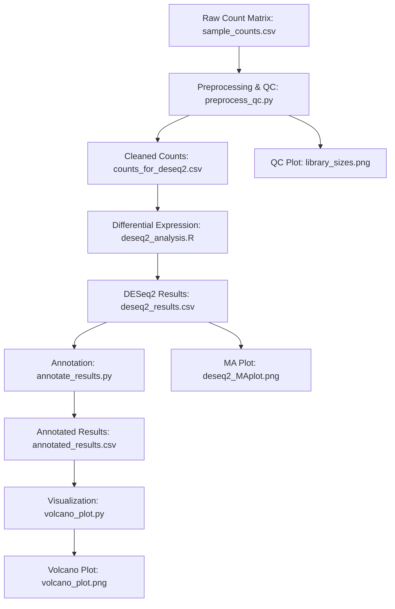

# Bioinformatics Pipeline

This project provides a modular framework for developing and optimizing bioinformatics tools and pipelines, with a focus on RNA-Seq and single-cell RNA-Seq analysis, cohort analysis, and interactive data visualization. It is designed for collaboration with laboratory scientists and supports drug discovery initiatives.

## Features
- Bulk RNA-Seq analysis (DESeq2, cohort analysis)
- **Single-cell RNA-Seq analysis (Seurat, R) with demo data and automated workflow**
- Interactive data visualization (Plotly Dash, Shiny)
- Workflow management (Snakemake, Nextflow)
- Protocols, SOPs, and QC reporting
- Training and documentation for junior staff

## Project Structure
- `rna_seq/` — Bulk RNA-Seq analysis scripts and pipelines
- `scrna_seq/` — Single-cell RNA-Seq analysis scripts, demo data, and results (Seurat, R)
- `visualization/` — Interactive visualization tools (Dash, Shiny)
- `workflows/` — Workflow management scripts (Snakemake, Nextflow)
- `docs/` — Protocols, SOPs, and documentation
## Single-cell RNA-Seq Analysis Pipeline (Seurat)

This pipeline demonstrates end-to-end single-cell RNA-Seq analysis using the Seurat R package, including:
- Data loading (10x Genomics format, with demo data provided)
- Quality control and filtering (tuned for synthetic data)
- Normalization and feature selection
- Dimensionality reduction (PCA, UMAP)
- Clustering (with adjustable resolution)
- Marker gene identification
- Visualization (UMAP, feature plots)

### How to Run the Demo
1. Activate your R environment with Seurat and tidyverse installed.
2. From the project root, run:
   ```bash
   cd scrna_seq
   Rscript scrna_seq_analysis.R
   ```
3. Results (plots, marker genes, Seurat object) will be saved in `scrna_seq/results/`.

### Demo Data
- Demo 10x-style dataset (500 genes × 50 cells, realistic sparse counts) is included in `scrna_seq/data/demo_10x/`.
- The pipeline is tuned to work with this synthetic data, but can be adapted for real datasets.


## Getting Started
1. Clone the repository and set up your Python and R environments.
2. Explore the `rna_seq/` and `single_cell/` folders for analysis scripts.
3. Use the `workflows/` folder for reproducible pipeline execution.
4. See `docs/` for protocols and training materials.

## Collaboration
Contributions are welcome! Please open issues or submit pull requests for new features, bug fixes, or documentation improvements.

## License
MIT License.

## Bulk RNA-Seq Analysis Pipeline (Step-by-Step)

This pipeline automates bulk RNA-Seq analysis from raw count matrix to annotated results and visualization. It is managed by Snakemake for reproducibility and modularity.

### Steps:

1. **Preprocessing & QC** (`preprocess_qc.py`)
   - Input: Raw count matrix (`sample_counts.csv`)
   - Performs quality control, summary statistics, and generates a library size plot.
   - Outputs: Cleaned count matrix (`counts_for_deseq2.csv`), QC plot (`library_sizes.png`).

2. **Differential Expression Analysis** (`deseq2_analysis.R`)
   - Input: Cleaned count matrix
   - Runs DESeq2 in R to identify differentially expressed genes between conditions.
   - Outputs: DESeq2 results (`deseq2_results.csv`), MA plot (`deseq2_MAplot.png`).

3. **Annotation** (`annotate_results.py`)
   - Input: DESeq2 results and gene annotation file (`gene_annotation.csv`)
   - Merges gene-level results with gene symbols/descriptions for interpretability.
   - Output: Annotated results (`annotated_results.csv`).

4. **Visualization** (`volcano_plot.py`)
   - Input: Annotated results
   - Generates a volcano plot to visualize significant genes.
   - Output: Volcano plot image (`volcano_plot.png`).


### How to Run

1. Activate the virtual environment:
   ```bash
   source .venv/bin/activate
   ```
2. Run the pipeline from the project root directory:
   ```bash
   snakemake --snakefile workflows/Snakefile --cores 1 --printshellcmds
   ```
3. All outputs will be generated in the `rna_seq/` directory.

### File Overview
- `rna_seq/sample_counts.csv`: Example input count matrix
- `rna_seq/gene_annotation.csv`: Example gene annotation file
- `rna_seq/preprocess_qc.py`: Python script for QC and preprocessing
- `rna_seq/deseq2_analysis.R`: R script for DESeq2 analysis
- `rna_seq/annotate_results.py`: Python script for annotation
- `rna_seq/volcano_plot.py`: Python script for volcano plot
- `workflows/Snakefile`: Snakemake workflow definition

### Customization
- Edit `config.yaml` to change input files or parameters.
- Replace example data with your own for real analyses.

For questions or troubleshooting, see the comments in each script or open an issue.

## Data Processing & Analysis Pipeline (Mermaid Diagram)



This diagram summarizes the flow of data and analysis steps in the bulk RNA-Seq pipeline.

## Future Expansion

This repository is designed for extensibility. Planned and possible future enhancements include:

- **Single-cell RNA-Seq Analysis:** Integrate Seurat-based workflows for single-cell data processing and visualization.
- **Multi-omics Integration:** Add support for proteomics, metabolomics, or other omics data types.
- **Advanced Visualization:** Expand interactive dashboards (Dash, Shiny) for deeper data exploration.
- **Cloud & HPC Support:** Enable execution on cloud platforms or high-performance computing clusters.
- **Parameter Sweeps & Batch Analysis:** Automate large-scale analyses with parameter sweeps and batch processing.
- **Automated Reporting:** Generate comprehensive HTML or PDF reports summarizing results and QC.
- **User-friendly Interfaces:** Add GUIs or web interfaces for non-technical users.

Contributions and suggestions for new features are welcome!

## Integration Plan: Bulk and Single-cell RNA-Seq Analysis

Integrating bulk and single-cell RNA-Seq analyses provides a comprehensive view of gene expression, enabling both population-level and cell-type-specific insights. Here’s a practical integration plan you can present or implement:

### 1. Independent Analysis
- Run bulk RNA-Seq and single-cell RNA-Seq pipelines separately to obtain:
  - Differentially expressed (DE) genes from bulk (e.g., DESeq2 results)
  - Cluster-specific marker genes from single-cell (e.g., Seurat markers)

### 2. Comparative Analysis
- Compare DE genes from bulk with marker genes from single-cell clusters:
  - Identify which cell types or clusters drive the bulk expression changes.
  - Use Venn diagrams or heatmaps to visualize overlap.

### 3. Deconvolution
- Use single-cell data to deconvolute bulk RNA-Seq samples:
  - Estimate cell type proportions in bulk samples using single-cell reference profiles (e.g., CIBERSORTx, MuSiC).

### 4. Cross-validation
- Validate findings from one platform with the other:
  - Confirm bulk DE genes are expressed in relevant single-cell clusters.
  - Use single-cell data to interpret ambiguous bulk results.

### 5. Multi-omics Integration (Optional)
- Integrate with other omics data (e.g., proteomics, ATAC-seq) for deeper insights.

### 6. Reporting & Visualization
- Summarize integrated findings in joint plots, tables, and reports.
- Highlight how single-cell data refines or explains bulk results.

---

**Tip for Demonstration:**
- Show how your modular pipeline structure supports integration (e.g., by exporting results to common formats).
- Discuss how you would automate or script the comparative and deconvolution steps for real projects.
- Mention tools/packages you would use (e.g., Seurat, DESeq2, CIBERSORTx, custom R/Python scripts).

This plan demonstrates both technical skill and strategic thinking for modern bioinformatics projects.

## Methods Overview

### Bulk RNA-Seq (DESeq2)
- **Normalization:** Adjusts for sequencing depth and RNA composition using size factors.
- **Statistical Model:** Models gene counts with a negative binomial distribution to account for biological and technical variability.
- **Differential Expression:** Uses hypothesis testing (Wald test or likelihood ratio test) to identify genes with significant expression changes between conditions.
- **Multiple Testing Correction:** Adjusts p-values (e.g., Benjamini-Hochberg) to control the false discovery rate.
- **Visualization:** Volcano and MA plots display the magnitude and significance of gene expression changes.

### Single-cell RNA-Seq (Seurat)
- **Quality Control:** Filters cells based on gene/cell counts and mitochondrial content to remove low-quality cells.
- **Normalization:** Log-normalizes counts to account for sequencing depth per cell.
- **Feature Selection:** Identifies highly variable genes for downstream analysis.
- **Dimensionality Reduction:** Uses PCA to reduce noise and UMAP/tSNE for visualization.
- **Clustering:** Constructs a nearest-neighbor graph and applies the Louvain or Leiden algorithm to find cell clusters.
- **Marker Gene Detection:** Finds genes specifically expressed in each cluster using statistical tests (e.g., Wilcoxon rank-sum).

### Integration
- **Comparative Analysis:** Compares DE genes from bulk with marker genes from single-cell clusters to link population-level changes to specific cell types.
- **Deconvolution:** Uses single-cell profiles to estimate cell type proportions in bulk samples (tools: CIBERSORTx, MuSiC).
- **Cross-validation:** Confirms findings across data types for robust biological interpretation.
