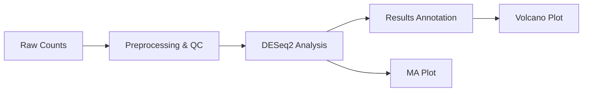

# Bioinformatics Analysis Pipeline

[](https://opensource.org/licenses/MIT)
[](https://snakemake.github.io)
[](https://www.r-project.org/)

A modular and reproducible framework for developing and optimizing bioinformatics tools and pipelines. Focused on RNA-Seq and single-cell RNA-Seq analysis, cohort studies, and interactive data visualization. Designed for collaboration with laboratory scientists and supports drug discovery initiatives.

## ✨ Features

*   **Bulk RNA-Seq Analysis:** Automated pipeline from counts to annotated results using DESeq2.
*   **Single-cell RNA-Seq Analysis:** End-to-end analysis with Seurat (R), including demo data.
*   **Interactive Visualization:** Dash (Python) and Shiny (R) apps for data exploration.
*   **Reproducible Workflows:** Managed with Snakemake and Nextflow.
*   **Documentation & Training:** Comprehensive protocols, SOPs, and materials for team collaboration.
*   **QC & Reporting:** Integrated quality control and reporting at every step.

## 📁 Project Structure

```
bioinformatics-pipeline/
├── rna_seq/                 # Bulk RNA-Seq analysis (DESeq2)
├── scrna_seq/               # Single-cell RNA-Seq analysis (Seurat)
│   ├── data/                # Input data (includes demo dataset)
│   ├── scrna_seq_analysis.R # Main analysis script
│   └── results/             # Output directory for plots & results
├── visualization/           # Interactive apps (Dash, Shiny)
├── workflows/               # Pipeline definitions (Snakemake, Nextflow)
└── docs/                    # Protocols, SOPs, and documentation
```

## 🚀 Quick Start

### Bulk RNA-Seq Pipeline (Snakemake)

1.  **Set up the environment:**
    ```bash
    source .venv/bin/activate  # Activate your virtual environment
    ```

2.  **Run the entire pipeline:**
    ```bash
    snakemake --snakefile workflows/Snakefile --cores 1 --printshellcmds
    ```
    *Outputs will be generated in the `rna_seq/` directory.*

### Single-cell RNA-Seq Demo (Seurat)

1.  **Navigate to the scRNA-seq directory and run the analysis:**
    ```bash
    cd scrna_seq
    Rscript scrna_seq_analysis.R
    ```
    *Results (plots, markers, Seurat object) will be saved in `scrna_seq/results/`.*

---

## 🔬 Pipeline Details

### 1. Bulk RNA-Seq Analysis

A Snakemake-managed pipeline for differential expression analysis.

**Workflow Overview:**


**Steps:**
1.  **Preprocessing & QC** (`preprocess_qc.py`): Loads `sample_counts.csv`, performs QC, and outputs a cleaned matrix and library size plot.
2.  **Differential Expression** (`deseq2_analysis.R`): Runs DESeq2 to identify DEGs. Outputs results and an MA plot.
3.  **Annotation** (`annotate_results.py`): Merges results with `gene_annotation.csv` for biological context.
4.  **Visualization** (`volcano_plot.py`): Generates a volcano plot from the annotated results.

### 2. Single-Cell RNA-Seq Analysis

A Seurat-based pipeline for analyzing scRNA-seq data.

**Steps include:**
*   Data loading (10x Genomics format supported)
*   Quality control and filtering
*   Normalization and feature selection
*   Dimensionality reduction (PCA, UMAP)
*   Clustering and marker gene identification
*   Visualization (UMAP plots, feature plots)

**Demo Data:** A synthetic 10x-style dataset (500 genes x 50 cells) is provided in `scrna_seq/data/demo_10x/` to test the pipeline.

---

## 🧠 Integration Strategy: Bulk & Single-Cell

A key strength of this framework is the ability to integrate findings across data modalities.

1.  **Independent Analysis:** Run bulk and single-cell pipelines separately to get DEGs and cluster markers.
2.  **Comparative Analysis:** Overlap DEGs from bulk with marker genes from single-cell to identify which cell types drive population-level changes.
3.  **Deconvolution:** Use single-cell data as a reference (e.g., with CIBERSORTx) to estimate cell type proportions in bulk samples.
4.  **Cross-Validation:** Validate bulk findings by confirming DEG expression in specific cell clusters from the single-cell data.

*This integrated approach provides a more complete biological narrative, linking population-level changes to their cellular origins.*

## 🧪 Methods Overview

| Analysis Type | Key Tools | Primary Methods |
| :--- | :--- | :--- |
| **Bulk RNA-Seq** | DESeq2, Snakemake | Negative binomial GLM, Wald test, FDR correction |
| **Single-Cell RNA-Seq** | Seurat | Log-normalization, HVG selection, PCA, graph-based clustering, Wilcoxon rank-sum test |

---

## 🔮 Future Roadmap

This repository is designed for extensibility. Planned enhancements include:
*   **Multi-omics Integration:** Support for proteomics, metabolomics, and ATAC-seq data.
*   **Advanced Visualization:** Enhanced interactive dashboards for integrated data exploration.
*   **Cloud/HPC Support:** Scale analyses on cloud platforms and high-performance clusters.
*   **Automated Reporting:** Generate comprehensive HTML/PDF reports for sharing insights.
*   **Parameter Sweeps:** Tools for automated large-scale batch analysis and optimization.

## 🤝 Collaboration

Contributions are welcome! Please feel free to:
1.  Open an issue for bug reports, feature requests, or questions.
2.  Submit a pull request for new features, optimizations, or documentation improvements.

## 📄 License

This project is licensed under the MIT License. See the LICENSE file for details.

```