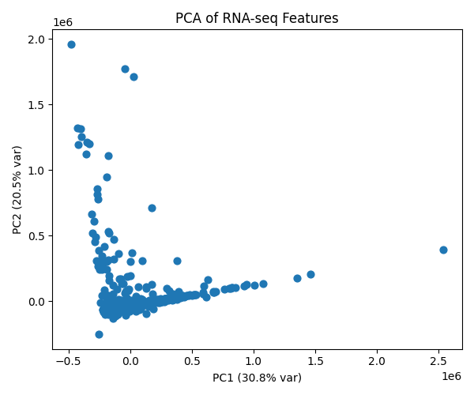
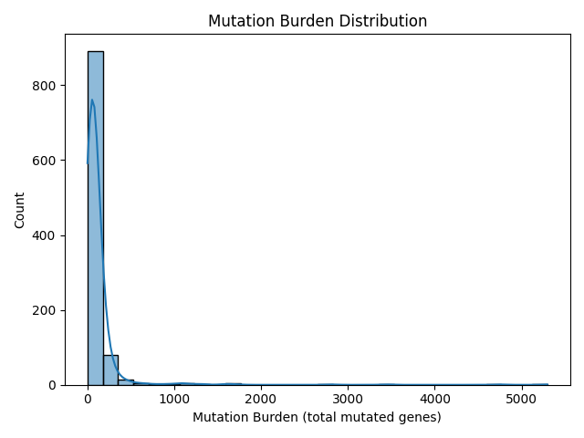

# Analysis Highlights

## Key Results

### PCA Plot of RNA-seq Features

### Mutation Burden Distribution

### Top 10 Mutated Genes (TCGA-BRCA)
| Gene   | Samples Mutated |
|--------|-----------------|
| PIK3CA | 349             |
| TP53   | 348             |
| TTN    | 228             |
| MUC16  | 140             |
| CDH1   | 132             |
| GATA3  | 130             |
| KMT2C  | 104             |
| MAP3K1 | 92              |
| RYR2   | 89              |
| FLG    | 82              |

---

For full code and reproducibility, see the scripts and workflows in this repository.
